# Architecture Diagram

## Before Refactoring (Single-stage, Database-driven)

```mermaid
graph LR
    User([User Context]) --> AI{AI Engine}
    DB[(Database<br/>Prompt Templates)] --> AI
    AI --> LLM[Single-stage LLM Inference<br/>CONTEXT + Dynamic Prompt]
    LLM --> Output1[Output<br/>Decision JSON<br/>{decision, reply_text}]
    
    style AI fill:#4A90A4
    style LLM fill:#7DD3C0
    style Output1 fill:#A8E6CF
    style DB fill:#87CEEB
```

## After Refactoring (Two-stage, File-driven)

```mermaid
graph TB
    User2([User Context]) --> FileSystem[File System<br/>📁 Prompt Templates<br/>📁 Stage Strategy<br/>📁 Scenes]
    
    FileSystem --> Stage1{Stage 1:<br/>Routing Engine<br/>LLM}
    Stage1 --> SceneSelect[Scene Selection<br/>✓ Welcome<br/>□ Reply<br/>□ Reject]
    
    SceneSelect -->|Scene: Welcome| SceneFile[scenes/welcome.md]
    FileSystem --> SceneFile
    
    SceneFile --> Stage2{Stage 2:<br/>Execution Engine<br/>LLM}
    Stage2 --> Output2[Output<br/>Decision JSON<br/>{scene, message_style, reply_texts}]
    
    style Stage1 fill:#7DD3C0
    style Stage2 fill:#7DD3C0
    style Output2 fill:#A8E6CF
    style SceneSelect fill:#B8E6F0
    style FileSystem fill:#FFE5B4
```

## Alternative: Combined View

```mermaid
graph TB
    subgraph Before["Before Refactoring (Single-stage, Database-driven)"]
        U1([User]) --> DB1[(Database)]
        U1 --> AI1[AI Engine]
        DB1 --> AI1
        AI1 --> LLM1[Single LLM<br/>CONTEXT + Prompt]
        LLM1 --> OUT1[JSON Output<br/>decision, reply_text]
    end
    
    subgraph After["After Refactoring (Two-stage, File-driven)"]
        U2([User]) --> FS[File System<br/>Templates/Scenes]
        U2 --> S1[Stage 1: Routing<br/>LLM]
        FS --> S1
        S1 --> Scene[Scene Selection]
        Scene --> SceneFile2[scene.md]
        SceneFile2 --> S2[Stage 2: Execution<br/>LLM]
        FS --> S2
        S2 --> OUT2[JSON Output<br/>scene, style, texts]
    end
    
    style AI1 fill:#4A90A4
    style LLM1 fill:#7DD3C0
    style S1 fill:#7DD3C0
    style S2 fill:#7DD3C0
    style OUT1 fill:#A8E6CF
    style OUT2 fill:#A8E6CF
    style FS fill:#FFE5B4
```



## Usage

These Mermaid diagrams can be rendered in:
- GitHub/GitLab markdown files
- Notion
- VS Code with Mermaid extension
- Mermaid Live Editor (https://mermaid.live)
- Documentation sites (VitePress, Docusaurus, etc.)

