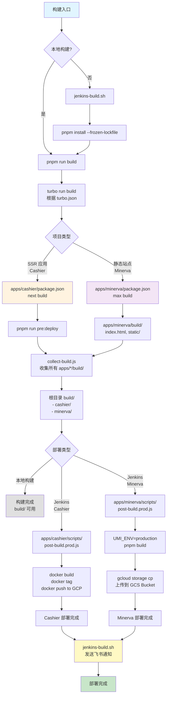
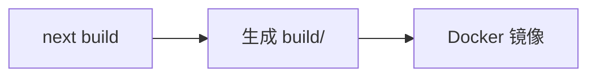
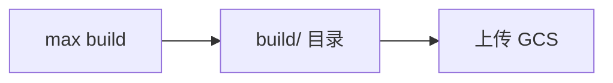

# 构建流程 - 文件调用流程图

## 📋 概述

本文档详细说明了 sitin-monorepo 项目的构建流程，包括本地构建和 CI/CD 构建的完整文件调用链路。

项目包含两种类型的应用：
- **SSR 应用** (如 Cashier): Next.js SSR 应用，使用 Docker 部署
- **静态站点** (如 Minerva): Umi 静态站点，部署到 GCS

---

## 🔄 构建流程类型

### 1️⃣ 本地开发构建
```bash
pnpm run build
```

### 2️⃣ Jenkins CI/CD 构建
```bash
bash scripts/jenkins-build.sh
```

---

## 📊 完整构建流程图



---

## 🏗️ 项目类型详解

### 1. SSR 应用 - Cashier (Next.js + Docker)

#### 构建流程


---

### 2. 静态站点 - Minerva (Umi + GCS)

#### 构建流程


---

## 📁 关键文件详解

### 1. 根目录配置文件

#### `scripts/jenkins-build.sh`
**功能**: Jenkins CI/CD 构建入口脚本

**执行步骤**:
1. 安装依赖 (`pnpm install --frozen-lockfile`)
2. 构建项目 (`pnpm run build`)
3. 执行应用的 post-build 脚本
4. 发送飞书通知（成功或失败）

**环境变量**:
- `Apps`: 应用名称 (如 `cashier`, `minerva`)
- `Environment`: 部署环境 (如 `development`, `production`)
- `FEISHU_WEBHOOK`: 飞书 Webhook URL（可选，有默认值）

**飞书通知**:
- 构建成功时发送成功通知（包含应用、环境、分支、提交、耗时信息）
- 构建失败时发送失败通知（包含错误信息）

---

#### `package.json` (root)
```json
{
  "scripts": {
    "build": "turbo run build && pnpm run collect:build",
    "collect:build": "node scripts/collect-build.js"
  }
}
```
**作用**:
- 定义主构建命令
- 通过 Turbo 并行构建所有应用
- 收集构建产物

---

## 📦 构建产物说明

### 本地构建产物

```
sitin-monorepo/
└── build/                    # 根目录构建产物
    ├── cashier/              # Cashier SSR 应用
    │   ├── server.js
    │   ├── package.json
    │   ├── .next/
    │   ├── public/
    │   └── Dockerfile
    └── minerva/              # Minerva 静态站点
        ├── index.html
        ├── umi.js
        ├── umi.css
        └── static/
```

### Jenkins 构建产物

**Cashier (Docker 镜像)**:
```
us-east1-docker.pkg.dev/heyhru-server/frontend-service/cashier:prod-1703234567890
us-east1-docker.pkg.dev/heyhru-server/frontend-service/cashier:latest-prod
```

**Minerva (GCS 静态站点)**:
```
gs://cai-admin-console/
├── index.html
├── umi.js
├── umi.css
└── static/
```

访问地址: `https://cai-admin-console.archat.us/`

---

## 🚀 执行示例

### 本地构建示例

```bash
# 1. 安装依赖
pnpm install

# 2. 构建所有应用
pnpm run build

# 输出:
# ✓ turbo run build
#   ✓ @sitin/api-proto:build
#   ✓ @sitin/http-client:build
#   ✓ @sitin/ua:build
#   ✓ @sitin/cashier:build
#     - next build
#     - pre-deploy.js
#   ✓ @sitin/minerva:build
#     - max build
# ✓ collect-build.js
#   📦 收集 apps/cashier/build/ → build/cashier/
#   📦 收集 apps/minerva/build/ → build/minerva/
```

### Jenkins 构建示例 - Cashier

```bash
# 设置环境变量
export Apps=cashier
export Environment=production
export IMAGE_TAG=prod-$(date +%s)
export FEISHU_WEBHOOK=https://open.feishu.cn/open-apis/bot/v2/hook/your-webhook-url

# 执行构建脚本
bash scripts/jenkins-build.sh

# 输出:
# [INFO] Step 1: Installing dependencies...
# [SUCCESS] Dependencies installed
# [INFO] Step 2: Building project...
# [SUCCESS] Build completed
# [INFO] Step 3: Running post-build for 'cashier'...
# [INFO] 构建 Docker 镜像...
# [INFO] 推送到 GCP...
# [INFO] 部署到生产环境...
# [SUCCESS] Build & Deploy Completed!
#
# 🔔 飞书通知已发送:
# [前端构建&部署] 2026-01-15 10:30:45
# 状态: ✅ 成功
# 应用: cashier
# 环境: production
# 分支: main
# 提交: a1b2c3d
# 耗时: 5m 30s
```

### Jenkins 构建示例 - Minerva

```bash
# 设置环境变量
export Apps=minerva
export Environment=production
export BUILD_NUMBER=v1.0.0
export FEISHU_WEBHOOK=https://open.feishu.cn/open-apis/bot/v2/hook/your-webhook-url

# 执行构建脚本
bash scripts/jenkins-build.sh

# 输出:
# [INFO] Minerva Build & Deploy (Production)
# [INFO] Shell parent path: /path/to/apps/minerva/scripts
# [INFO] Current path: /path/to/apps/minerva
#
# [INFO] Step 1: 构建项目...
# [INFO] 构建命令: UMI_ENV=production pnpm build
# [SUCCESS] 项目构建完成
#
# [INFO] Step 2: 部署文件到 GCS...
# [INFO] Bucket: gs://cai-admin-console/
# [INFO] Build 目录: /path/to/apps/minerva/build
# [SUCCESS] 主文件部署完成
#
# [SUCCESS] ========================================
# [SUCCESS] Build & Deploy Completed!
# [SUCCESS] ========================================
# [INFO] URL: https://cai-admin-console.archat.us/
# [INFO] Bucket: gs://cai-admin-console/
# [INFO] Version: v1.0.0
# [INFO] 总耗时: 2m 15s
# [SUCCESS] ========================================
#
# 🔔 飞书���知已发送:
# [前端构建&部署] 2026-01-15 10:35:20
# 状态: ✅ 成功
# 应用: minerva
# 环境: production
# 分支: main
# 提交: a1b2c3d
# 耗时: 2m 15s
```

---

## 🛠️ 故障排查

### 通用问题

1. **`build/` 目录不存在**
   - 确保先运行 `pnpm run build`
   - 检查应用的构建脚本是否执行成功
   - 查看 Turbo 日志: `turbo run build --force`

2. **Turbo 缓存问题**
   - 清除缓存: `turbo run build --force`
   - 完全清理: `pnpm run clean`

### Cashier 相关问题

3. **Docker 镜像构建失败**
   - 验证 `Dockerfile` 是否存在于 `build/` 目录
   - 检查 Docker 是否正确安装
   - 查看构建日志: `docker build --no-cache -t cashier build/`

4. **GCP Artifact Registry 推送失败**
   - 验证 Docker 已登录: `gcloud auth configure-docker us-east1-docker.pkg.dev`
   - 检查 GCP 项目 ID 和权限
   - 确认 Artifact Registry 已创建

### Minerva 相关问题

5. **Umi 构建失败**
   - 检查 `.umirc.ts` 配置
   - 清除缓存: `rm -rf .umi node_modules/.cache`
   - 重新安装: `pnpm install`

6. **GCS 上传失败**
   - 验证 gcloud 已安装: `gcloud --version`
   - 检查认证: `gcloud auth list`
   - 验证 bucket 存在: `gcloud storage ls gs://cai-admin-console/`
   - 检查权限: `gcloud storage buckets get-iam-policy gs://cai-admin-console/`

7. **部署后无法访问**
   - 检查 GCS bucket 是否配置为公开访问
   - 验证 Cloud Load Balancer 配置
   - 检查 DNS 记录: `nslookup cai-admin-console.archat.us`

---

## 📝 总结

### 关键文件调用链

#### Cashier (SSR 应用)
```
pnpm run build
  ↓
turbo run build (turbo.json)
  ↓
apps/cashier: next build
  ↓
生成 apps/cashier/build/
  ↓
collect-build.js (复制到根 build/)
  ↓
[Jenkins] post-build.prod.js (构建 Docker 镜像并推送)
  ↓
部署到 GCP Compute Engine
```

#### Minerva (静态站点)
```
pnpm run build
  ↓
turbo run build (turbo.json)
  ↓
apps/minerva: max build
  ↓
生成 apps/minerva/build/
  ↓
collect-build.js (复制到根 build/)
  ↓
[Jenkins] post-build.prod.js
  ↓
UMI_ENV=production pnpm build → 上传 GCS
```


